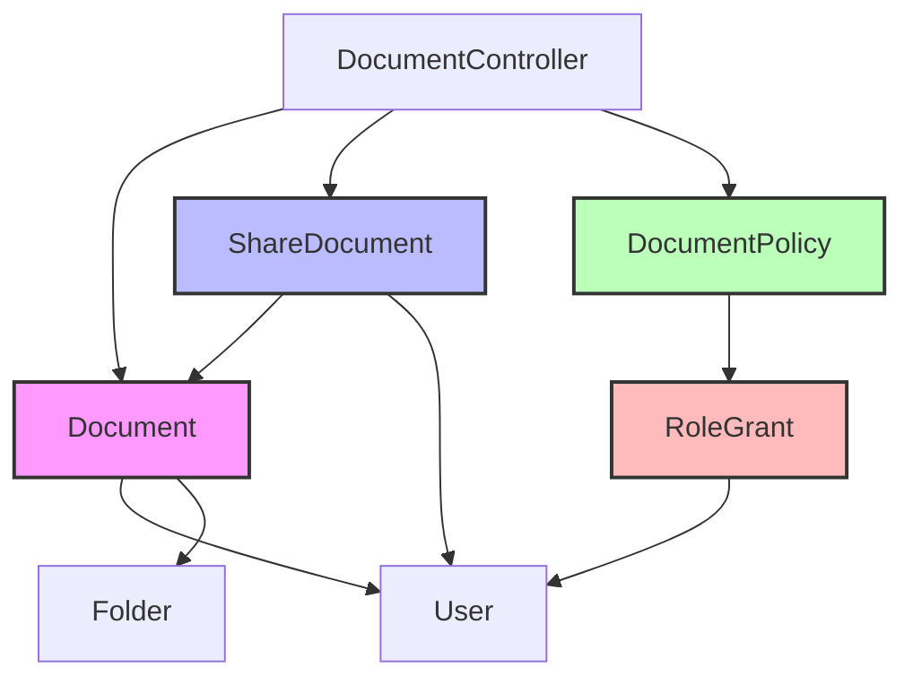

# Document Visibility and Sharing System Feature Analysis

## 1. System Overview

The document visibility and sharing system provides role-based access control (RBAC) functionality for managing document access in the application. It combines a basic visibility state system with a flexible sharing mechanism to control who can view, download, edit, comment on, and share documents.

## 2. Core Components

### 2.1 Models

#### Document Model (`app/Models/Document.php`)
- **Key Attributes**:
  - `visibility`: Public or private state (boolean)
  - `owner_id`: User who created the document
  - `folder_id`: Folder containing the document
  - `is_encrypted`: Encryption status
  - `enc_* fields`: AES-256-GCM encryption metadata

- **Relationships**:
  - `owner()`: User who created the document
  - `tags()`: Associated tags
  - `comments()`: Comments on the document
  - `stegoDocument()`: StegoDocument relationship for encrypted content

- **Key Methods**:
  - `isPublic()`: Check if document is public
  - `hasPhysicalFile()`: Check if document has physical file on disk
  - `isStegoed()`: Check if document has stegoDocument
  - `deleteFile()`: Delete physical file from public path

#### ShareDocument Model (`app/Models/ShareDocument.php`)
- **Key Attributes**:
  - `shared_id`: Shared entity ID
  - `token`: Sharing token
  - `slug`: Share slug
  - `valid_until`: Expiration date
  - `visibility`: Public/private share state
  - `share_type`: Type of shared entity (document/folder)
  - `user_type`: Type of user (individual/role/team)
  - `user_id`: User ID (for individual shares)
  - `can_download`, `can_upload`, `can_edit`, `can_comment`, `can_share`: Individual permissions
  - `permission_level`: Predefined permission level

- **Permission Levels**:
  - `PERMISSION_VIEWER`: Can download only
  - `PERMISSION_COMMENTER`: Can download and comment
  - `PERMISSION_EDITOR`: Can download, comment, and edit
  - `PERMISSION_CO_OWNER`: Full access including sharing
  - `PERMISSION_OWNER`: Full access (document owner)

- **Key Methods**:
  - `setPermissionLevel()`: Set individual permissions based on level
  - `getPermissionLevel()`: Get current permission level
  - `hasPermission()`: Check if user has specific permission
  - `isOwner()`, `isCoOwner()`, `isEditor()`, `isCommenter()`, `isViewer()`: Role checks
  - `isPublic()`: Check if share is public
  - `hasExpired()`: Check if share has expired

#### DocumentPolicy (`app/Policies/DocumentPolicy.php`)
- Currently unimplemented policy for document access control
- Methods include: `viewAny()`, `view()`, `create()`, `update()`, `delete()`, `restore()`, `forceDelete()`

### 2.2 Controllers

#### DocumentController (`app/Http/Controllers/DocumentController.php`)
- **Key Methods**:
  - `index()`: List all documents (public and private)
  - `getFiles()`: Get files in a folder with optional tag filtering
  - `uploadDocumentFiles()`: Upload new document
  - `updateVisibility()`: Toggle document visibility (public/private)
  - `download()`: Download document with encryption support
  - `view()`: View document in browser with encryption support
  - `show()`: Show document details
  - `update()`: Update document details
  - `destroy()`: Delete document

## 3. Current Visibility and Sharing System

### 3.1 Visibility States

The system supports two main visibility states:

1. **Public Documents**: Visible to everyone
   - All users can view and download public documents
   - Default state when document is created

2. **Private Documents**: Only visible to owner and shared users
   - Only document owner can view and download by default
   - Can be shared with specific users via ShareDocument

### 3.2 Current Access Control

From `DocumentController.php`:
```php
// Download permission check (line 172-174)
if ($document->visibility === 'private' && $document->owner_id !== $user->id) {
    abort(403, 'You do not have permission to download this document.');
}

// View permission check (line 215-217)
if ($document->visibility === 'private' && $document->owner_id !== $user->id) {
    abort(403, 'You do not have permission to view this document.');
}
```

### 3.3 Sharing System

The ShareDocument model supports:

1. **Individual User Sharing**: Share with specific users
2. **Permission Levels**: Granular control over document actions
3. **Expiration Dates**: Time-limited sharing
4. **Public Sharing**: Public share links with optional password protection
5. **Document and Folder Sharing**: Support for sharing both individual documents and entire folders

## 4. Role-Based Access Control (RBAC) Integration

### 4.1 Predefined Roles (from RoleSeeder)

#### Admin (45 permissions)
- Full system access
- Can view, download, edit, delete all documents (public and private)
- Can manage users, roles, and permissions
- Can view system logs

#### Owner (40 permissions)
- Team and document management
- Can view, download, edit, delete all non-private documents
- Can manage team members
- Can share documents with team members

#### User (25 permissions)
- Individual user operations
- Can view, download, edit, delete their own documents
- Can share their own documents with others
- Can comment on documents

### 4.2 Role-Based Document Visibility

With the current system, role-based document visibility can be achieved through:

1. **Document Visibility State**: Private documents are only visible to owner
2. **Document Ownership**: Each document has an owner with specific role
3. **Sharing with Roles**: ShareDocument supports sharing with user types (individual/role/team)

### 4.3 Enhanced Role-Based Policy

To fully leverage the RBAC system, the DocumentPolicy should be implemented as follows:

```php
// app/Policies/DocumentPolicy.php
public function view(User $user, Document $document): bool
{
    // Owner can always view
    if ($document->owner_id === $user->id) {
        return true;
    }
    
    // Admin can view all documents
    if ($user->isAdmin()) {
        return true;
    }
    
    // Owner can view all documents (for their team)
    if ($user->isOwner() && $document->visibility !== 'private') {
        return true;
    }
    
    // Check if user has been shared the document
    if (ShareDocument::where('share_id', $document->id)
        ->where('user_id', $user->id)
        ->exists()
    ) {
        return true;
    }
    
    // Check if document is public
    return $document->visibility === 'public';
}
```

## 5. System Architecture



## 6. Key Features and Functionality

### 6.1 Current Features

1. **Document Visibility Toggle**: Users can switch between public and private
2. **Document Sharing**: Share documents with specific users
3. **Permission Levels**: Granular control over document actions
4. **Expiration Dates**: Time-limited sharing
5. **Public Share Links**: Share documents with public URLs
6. **Encryption Support**: AES-256-GCM encryption for sensitive documents
7. **Download and View**: Support for downloading and in-browser viewing

### 6.2 Missing Features

1. **Role-Based Sharing**: Sharing with entire roles or teams
2. **Role-Based Visibility**: Documents visible only to specific roles
3. **Document Policy Enforcement**: Full implementation of DocumentPolicy
4. **Access Logging**: Detailed access logs for document actions
5. **Password Protection**: Password protection for public shares
6. **Share Notifications**: Email notifications for shared documents

## 7. Security Considerations

### 7.1 Current Security

- **Encryption**: AES-256-GCM encryption for physical files
- **Private Documents**: Restricted to owner only (unless shared)
- **Share Expiration**: Time-limited sharing

### 7.2 Potential Improvements

- **Role-Based Access Control**: Implement full RBAC system
- **Access Control List (ACL)**: Granular document-level permissions
- **Password Protection**: Add password protection for shares
- **Two-Factor Authentication**: Require 2FA for document access
- **IP Whitelisting**: Restrict access to specific IP addresses

## 8. Usage Examples

### 8.1 Sharing a Document

```php
// Share document with specific user
ShareDocument::create([
    'shared_id' => $document->id,
    'name' => $document->name,
    'share_type' => 'document',
    'user_type' => 'individual',
    'user_id' => $user->id,
    'permission_level' => ShareDocument::PERMISSION_EDITOR,
    'valid_until' => Carbon::now()->addDays(7),
]);

// Share document with role
ShareDocument::create([
    'shared_id' => $document->id,
    'name' => $document->name,
    'share_type' => 'document',
    'user_type' => 'role',
    'user_id' => 'admin', // Role name
    'permission_level' => ShareDocument::PERMISSION_VIEWER,
]);
```

### 8.2 Checking Document Access

```php
// Check if user can view document
if ($user->can('view', $document)) {
    // Allow access
}

// Check if user can edit document
if ($user->can('update', $document)) {
    // Allow edit
}
```

## 9. Implementation Status

### 9.1 Completed

- [x] Document model with visibility state
- [x] ShareDocument model with permission levels
- [x] DocumentController with visibility and download checks
- [x] RoleSeeder with predefined roles and permissions
- [x] UserSeeder with sample user accounts

### 9.2 In Progress

- [ ] DocumentPolicy implementation
- [ ] Role-based sharing functionality
- [ ] Enhanced access control checks

### 9.3 To Be Implemented

- [ ] Role-based document visibility
- [ ] Share notifications
- [ ] Password protection for shares
- [ ] Access logging
- [ ] Two-factor authentication

## 10. Conclusion

The document visibility and sharing system provides a solid foundation for role-based access control. With the RBAC system already in place, implementing enhanced role-based document visibility and sharing features would be straightforward. The system supports private documents visible only to owners, public documents visible to everyone, and shareable documents with granular permission control.

Key improvements would include implementing the DocumentPolicy to enforce role-based access, adding role-based sharing capabilities, and enhancing the sharing system with features like password protection and share notifications.
