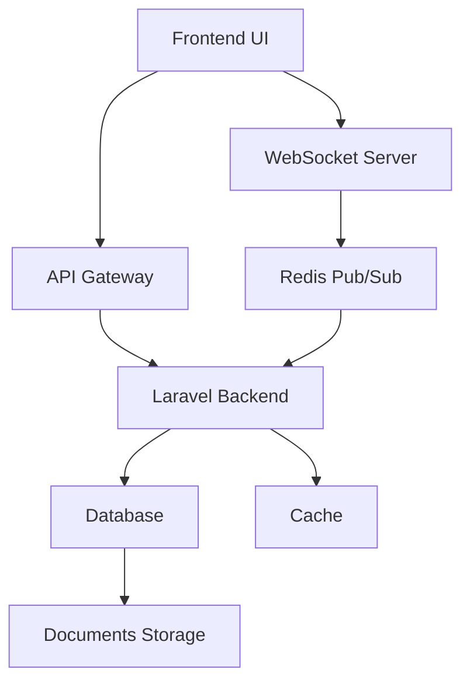

# Collaboration and Sharing Feature Architecture

## Overview

This plan outlines the implementation of a visually intuitive, fully functional user interface for seamless project sharing and real-time collaboration. The system will support multi-user access, permissions management, and content synchronization.

## Current Status Analysis

### Existing Features
- Document management system with upload, download, and preview
- Folder structure organization
- StegoLock encoding/decoding functionality
- Basic sharing through ShareDocument model
- Stego document grants for access control
- Comments system

### Limitations
- No real-time collaboration capabilities
- No live presence indicators
- Basic sharing mechanism without fine-grained permissions
- No content synchronization across users
- No collaborative editing features

## Architecture Design

### System Components



### Technology Stack

#### Frontend
- React 18 with TypeScript
- Inertia.js for SSR
- Tailwind CSS for styling
- Pusher or Socket.io for WebSocket communication
- Quill or Slate for rich text editing
- React Flow for real-time collaboration

#### Backend
- Laravel 10
- Laravel Echo for broadcasting
- Redis for pub/sub and caching
- MySQL/PostgreSQL for data storage
- Laravel Sanctum for authentication
- Node.js WebSocket server (optional)

## Feature Implementation Plan

### 1. Real-time Collaboration Backend

**Goal**: Establish the infrastructure for real-time communication between users

**Tasks**:
- Configure Laravel Echo and broadcasting system
- Set up Redis for pub/sub communication
- Create WebSocket event system for document synchronization
- Implement channel authentication and authorization
- Add rate limiting and connection management

### 2. Collaboration Workspace Interface

**Goal**: Create a visually intuitive workspace for collaborative editing

**Tasks**:
- Design collaboration dashboard layout
- Implement document editor with real-time updates
- Add sidebar for participants and chat
- Create toolbar with collaboration-specific features
- Implement responsive design for mobile and desktop

### 3. Multi-user Access and Permissions Management

**Goal**: Provide fine-grained control over document access

**Tasks**:
- Extend ShareDocument model with permission levels
- Create permissions management UI (viewer, editor, commenter, owner)
- Implement role-based access control (RBAC)
- Add invitation system with email notifications
- Create access request and approval workflow

### 4. Real-time Content Synchronization

**Goal**: Ensure all users see consistent document state

**Tasks**:
- Implement operational transformation for conflict resolution
- Create document versioning system
- Add real-time diff and merge functionality
- Implement autosave and version history
- Optimize synchronization for large documents

### 5. Document Sharing and Invitation System

**Goal**: Make sharing simple and intuitive

**Tasks**:
- Create share modal with sharing options
- Implement link sharing with expiration dates
- Add email invitation system
- Create shareable links with permissions
- Add social media integration for sharing

### 6. Live Cursors and Presence Indicators

**Goal**: Show who's active and what they're doing

**Tasks**:
- Implement real-time cursor tracking
- Add user presence indicators
- Create live typing indicators
- Add user hover cards with profile info
- Implement collaborative selection highlighting

### 7. Collaborative Commenting and Annotation

**Goal**: Enable discussions within documents

**Tasks**:
- Extend comment system for real-time updates
- Add inline commenting on specific text
- Implement annotations and highlighting
- Add @mention functionality
- Create comment threading system

### 8. Version Control and Conflict Resolution

**Goal**: Manage document versions and conflicts

**Tasks**:
- Implement automatic version creation on changes
- Create version history UI
- Add restore and compare functionality
- Implement conflict detection and resolution
- Add collaborative conflict resolution tools

### 9. Collaboration Activity Feed and Notifications

**Goal**: Keep users informed about changes

**Tasks**:
- Create real-time activity feed
- Implement notification system
- Add email notifications for important events
- Create in-app notification center
- Add push notifications (mobile)

## Database Design

### Updated ShareDocument Model
```php
// app/Models/ShareDocument.php
protected $fillable = [
    'shared_id', 'name', 'token',
    'slug', 'valid_until', 'visibility',
    'share_id', 'share_type', 'user_type', 'user_id',
    'can_download', 'can_upload', 'can_edit', 'can_comment', 'can_share',
];

protected $casts = [
    'can_download' => 'boolean',
    'can_upload'   => 'boolean',
    'can_edit'     => 'boolean',
    'can_comment'  => 'boolean',
    'can_share'    => 'boolean',
];
```

### New Collaboration Tables
- `collaboration_sessions` - Tracks active collaboration sessions
- `collaboration_events` - Stores real-time collaboration events
- `document_versions` - Manages document version history
- `collaboration_permissions` - Fine-grained permission management
- `user_presence` - Tracks user presence in documents
- `notification_subscriptions` - Manages notification preferences

## API Routes

### Collaboration Endpoints
```php
// routes/api.php
Route::prefix('collaboration')->name('api.collaboration.')->group(function () {
    Route::post('/sessions', [CollaborationController::class, 'startSession']);
    Route::post('/sessions/{id}/join', [CollaborationController::class, 'joinSession']);
    Route::post('/sessions/{id}/leave', [CollaborationController::class, 'leaveSession']);
    Route::post('/documents/{id}/events', [CollaborationController::class, 'sendEvent']);
    Route::post('/documents/{id}/grants', [CollaborationController::class, 'grantAccess']);
    Route::delete('/documents/{id}/grants/{userId}', [CollaborationController::class, 'revokeAccess']);
});
```

## UI/UX Design Principles

### Visual Hierarchy
- Clear distinction between own content and collaborator content
- Visual indicators for active participants
- Color-coded contributions and comments
- Consistent typography and spacing

### Intuitive Interactions
- Real-time feedback on actions
- Smooth transitions between views
- Contextual menus and tooltips
- Keyboard shortcuts for power users

### Responsive Design
- Mobile-first approach
- Adaptive layouts for different screen sizes
- Touch-optimized interactions

## Performance Optimization

### Frontend Optimizations
- Virtual DOM diffing
- Lazy loading components
- WebSocket connection pooling
- Efficient state management
- Image and file compression

### Backend Optimizations
- Redis caching for frequent operations
- Database query optimization
- Event batching and throttling
- Load balancing WebSocket connections
- CDN integration

## Security Considerations

- WebSocket authentication and authorization
- Encrypted communication (WSS)
- Input validation and sanitization
- Rate limiting to prevent abuse
- Audit logging for sensitive operations

## Testing Strategy

### Unit Tests
- WebSocket event handling
- Permission management
- Document synchronization
- Conflict resolution

### Integration Tests
- End-to-end collaboration scenarios
- Multi-user sessions
- Performance testing
- Load testing

## Rollout Plan

1. **Phase 1**: Backend infrastructure and basic collaboration (2 weeks)
2. **Phase 2**: UI implementation and core features (3 weeks)  
3. **Phase 3**: Advanced features and optimizations (2 weeks)
4. **Phase 4**: Testing and bug fixing (1 week)
5. **Phase 5**: Deployment and monitoring (1 week)

## Success Metrics

- User adoption rate of collaboration features
- Number of active collaboration sessions
- Collaboration session duration
- User satisfaction scores
- Performance benchmarks
