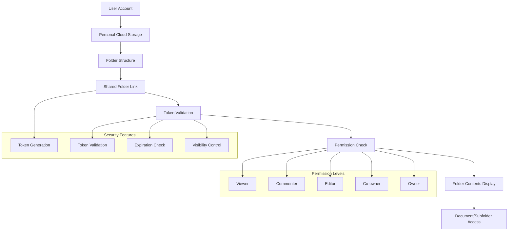
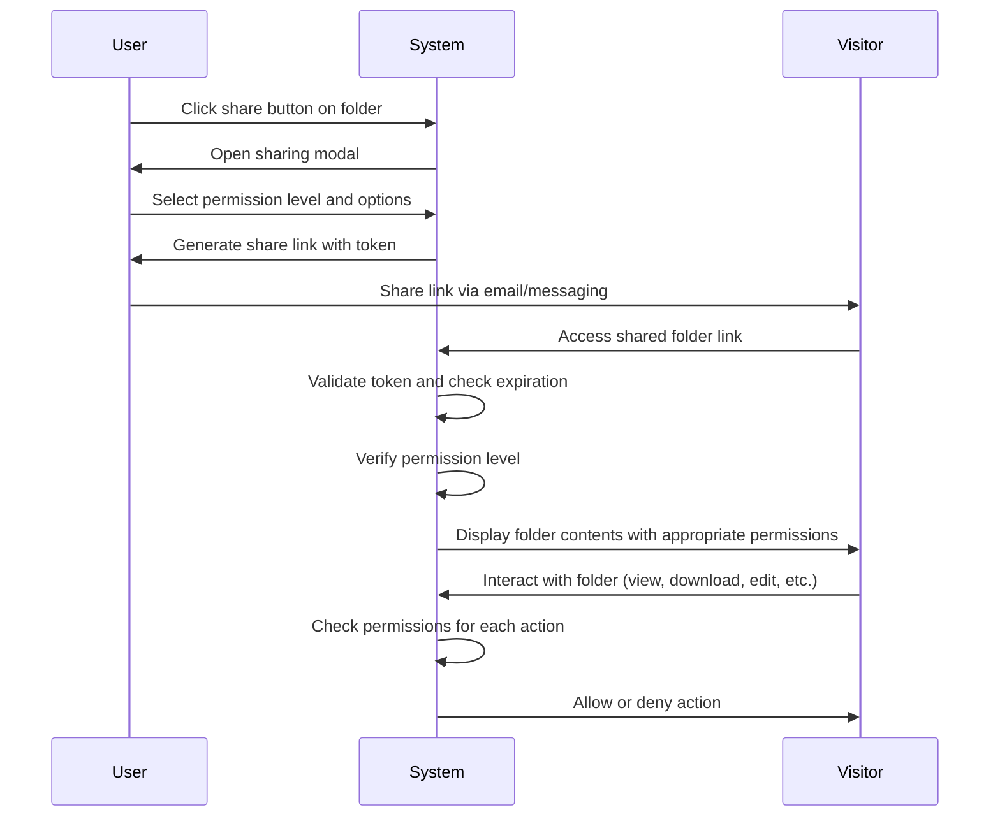

# Enhanced Folder Sharing with Personal Cloud Storage

## Overview
This plan outlines the implementation of enhanced personal cloud storage functionality where each user account has personal cloud storage similar to Google Drive, with folder access restricted to only those with a shared specific link.

## Current System Analysis
- Existing folder structure with nested folders and documents
- ShareDocument model supports folder sharing with various permission levels
- Document sharing modal with permission levels (Viewer, Commenter, Editor, Co-owner)
- ShareDocumentController handles sharing logic for documents, folders, and stego files

## Enhanced Features
### 1. Folder Sharing UI Enhancement
- Add share button to folder row in folder management page
- Create folder sharing modal with similar functionality to document sharing
- Implement folder sharing link generation
- Add shared folder view page to display folder contents to users with link access

### 2. Permission Management
- Extend existing permission levels to folder sharing
- Implement folder-level access control based on permissions
- Support for can_download, can_upload, can_edit, can_comment, can_share permissions
- Permission levels: Viewer, Commenter, Editor, Co-owner, Owner

### 3. Security and Validation
- Token-based access control for shared folders
- Expiration date for shared links
- Public/private visibility settings
- Secure token generation and validation
- Access log tracking for shared folder access

## Architecture Diagram


## Workflow Diagram


## Implementation Tasks

### 1. Frontend Tasks
- [ ] Add share button to folder row component in `resources/js/Pages/Folders/Index.tsx`
- [ ] Modify ShareModal to handle folder sharing with appropriate title and messages
- [ ] Create shared folder view page in `resources/js/Pages/Shares/Folder.tsx`
- [ ] Implement folder contents display with permission-based UI
- [ ] Add folder sharing management to user dashboard

### 2. Backend Tasks
- [ ] Extend ShareDocumentController to handle folder sharing endpoints
- [ ] Create API endpoint for fetching shared folder contents
- [ ] Implement folder access control middleware
- [ ] Add security checks and validation for shared folder access
- [ ] Extend access log tracking to include folder access

### 3. Database Tasks
- [ ] No changes needed - existing ShareDocument table structure supports folder sharing

### 4. Testing and Validation
- [ ] Test folder sharing functionality
- [ ] Test permission-based access control
- [ ] Test token validation and expiration
- [ ] Test shared folder view page
- [ ] Test folder sharing management

## Technical Specifications

### Share Link Structure
```
https://app-domain.com/shares/folder/{folder_id}/{token}
```

### Permission Matrix
| Permission Level | Can View | Can Download | Can Upload | Can Edit | Can Comment | Can Share |
|------------------|----------|--------------|------------|----------|-------------|-----------|
| Viewer           | ✔️        | ✔️            | ❌          | ❌        | ❌           | ❌         |
| Commenter        | ✔️        | ✔️            | ❌          | ❌        | ✔️           | ❌         |
| Editor           | ✔️        | ✔️            | ✔️          | ✔️        | ✔️           | ❌         |
| Co-owner         | ✔️        | ✔️            | ✔️          | ✔️        | ✔️           | ✔️         |
| Owner            | ✔️        | ✔️            | ✔️          | ✔️        | ✔️           | ✔️         |

## Benefits
- Enhanced personal cloud storage experience
- Easy sharing of entire folders with specific users
- Granular permission control for shared folders
- Secure token-based access
- Expiration dates for shared links
- Visibility settings (public/private)

## Risks and Mitigations
- **Security Risks**: Mitigated by using secure token generation, expiration dates, and permission checks
- **Performance Risks**: Mitigated by implementing efficient folder contents retrieval
- **User Experience Risks**: Mitigated by following existing UI patterns and providing clear feedback

## Next Steps
1. Implement frontend enhancements for folder sharing UI
2. Extend backend API endpoints for folder sharing
3. Create shared folder view page
4. Test the complete folder sharing functionality
5. Update documentation
