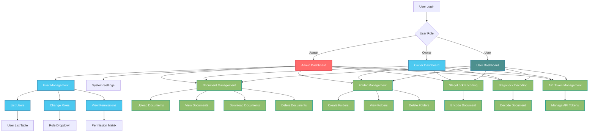

# Role-Based UI Architecture Diagram

## Role-Based Navigation Structure

### Admin Navigation
- **Dashboard** - Overview with aggregate statistics
- **Users** - Manage user roles and permissions
- **Documents** - Full document management
- **Folders** - Full folder management
- **Tags** - Full tag management
- **Categories** - Full category management
- **🔒 StegoLock** - Encode, Decode, My Docs, API Tokens

### Owner Navigation
- **Dashboard** - Overview with aggregate statistics
- **Documents** - Full document management
- **Folders** - Full folder management
- **Tags** - Full tag management
- **Categories** - Full category management
- **🔒 StegoLock** - Encode, Decode, My Docs, API Tokens

### User Navigation
- **Dashboard** - Overview with personal statistics
- **Documents** - Personal document management
- **Folders** - Personal folder management
- **🔒 StegoLock** - Encode, Decode, My Docs, API Tokens

## Role-Based Feature Access

### Admin Features
- ✅ View all users and their roles
- ✅ Change user roles
- ✅ View role permissions
- ✅ Full system access
- ✅ Manage API tokens
- ✅ Encode/decode stego documents
- ✅ Manage all documents/folders/tags/categories

### Owner Features
- ✅ View all users and their roles
- ✅ Change user roles
- ✅ View role permissions
- ✅ Manage team documents/folders/tags/categories
- ✅ Manage API tokens
- ✅ Encode/decode stego documents

### User Features
- ✅ View own role information
- ✅ Manage personal documents/folders
- ✅ Manage own API tokens
- ✅ Encode/decode own stego documents
- ✅ Share documents with others

## Permission Matrix

| Resource | Action | Admin | Owner | User |
|----------|--------|-------|-------|------|
| user | create | ✅ | ❌ | ❌ |
| user | read | ✅ | ✅ | ✅ (own) |
| user | update | ✅ | ✅ | ✅ (own) |
| user | delete | ✅ | ❌ | ❌ |
| document | create | ✅ | ✅ | ✅ |
| document | read | ✅ | ✅ | ✅ (own) |
| document | update | ✅ | ✅ | ✅ (own) |
| document | delete | ✅ | ✅ | ✅ (own) |
| folder | create | ✅ | ✅ | ✅ |
| folder | read | ✅ | ✅ | ✅ (own) |
| folder | update | ✅ | ✅ | ✅ (own) |
| folder | delete | ✅ | ✅ | ✅ (own) |
| tag | create | ✅ | ✅ | ❌ |
| tag | read | ✅ | ✅ | ✅ |
| tag | update | ✅ | ✅ | ❌ |
| tag | delete | ✅ | ✅ | ❌ |
| category | create | ✅ | ✅ | ❌ |
| category | read | ✅ | ✅ | ✅ |
| category | update | ✅ | ✅ | ❌ |
| category | delete | ✅ | ✅ | ❌ |
| stego_document | create | ✅ | ✅ | ✅ |
| stego_document | read | ✅ | ✅ | ✅ (own) |
| stego_document | update | ✅ | ✅ | ✅ (own) |
| stego_document | delete | ✅ | ✅ | ✅ (own) |
| system | manage | ✅ | ❌ | ❌ |
| system | view_logs | ✅ | ❌ | ❌ |
| system | configure_settings | ✅ | ❌ | ❌ |
| team | manage | ❌ | ✅ | ❌ |
| team | invite_user | ❌ | ✅ | ❌ |
| team | remove_user | ❌ | ✅ | ❌ |
| profile | update | ✅ | ✅ | ✅ |
| profile | change_password | ✅ | ✅ | ✅ |
